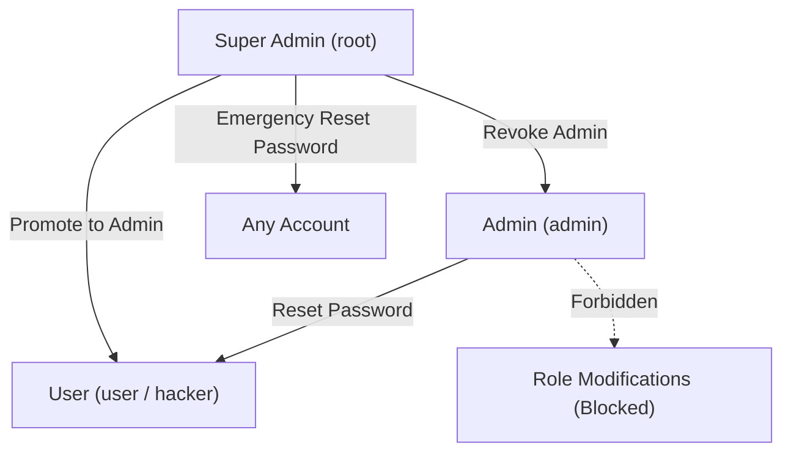

<div align="center">

# PHP FreeBase — Security Training Laboratory
### (CyberLab & CTF Training Edition)

**An Automated Penetration Testing & Cybersecurity Education Laboratory.**  
Pre-configured with realistic network services, automated deployment (`install.sh`), multi-tier role hierarchy (Super Admin, Admin, Users), database-backed security telemetry, and intentionally exposed ports for hands-on auditing.


</div>

---

> [!WARNING]
> **LABORATORY ENVIRONMENT DISCLAIMER**:  
> This version of **PHP FreeBase** is pre-configured strictly for **local educational training, cyber range exercises, and penetration testing benchmarks**. It sets open listening ports (80, 443, 3306, 22), simplified seed passwords (`root`, `password`, `user`, `hacker`), and a remote database listener. **DO NOT DEPLOY THIS LAB CONFIGURATION TO PUBLIC PRODUCTION HOSTS.**

---

## Table of Contents

1. [Lab Architecture & Network Ports](#1-lab-architecture--network-ports)
2. [Default Credentials Cheat Sheet](#2-default-credentials-cheat-sheet)
3. [Super Admin Role Management System](#3-super-admin-role-management-system)
4. [One-Step Installation Guide (`install.sh`)](#4-one-step-installation-guide-installsh)
   - [Debian & Ubuntu (Native / Sudo)](#debian--ubuntu-native--sudo)
   - [Android Termux](#android-termux)
   - [Windows (WSL & Docker Desktop)](#windows-wsl--docker-desktop)
   - [Docker Compose Quickstart](#docker-compose-quickstart)
5. [Database Architecture (Port 3306)](#5-database-architecture-port-3306)
6. [Web Application Architecture (Ports 80 & 443)](#6-web-application-architecture-ports-80--443)
7. [SSH Remote Shell Access (Port 22)](#7-ssh-remote-shell-access-port-22)
8. [Auditing & Penetration Testing Exercises](#8-auditing--penetration-testing-exercises)
9. [Automated Security Verification Suite](#9-automated-security-verification-suite)
10. [Troubleshooting & Common Lab Gotchas](#10-troubleshooting--common-lab-gotchas)
11. [License & Ethics](#11-license--ethics)

---

## 1. Lab Architecture & Network Ports

The laboratory environment exposes four core services designed to emulate real-world target environments:

```
                          [ Client / Pentester ]
                                    |
      +-----------------------------+-----------------------------+
      | (Port 80 TCP)               | (Port 443 TCP)              | (Port 3306 TCP)   | (Port 22 TCP)
      v                             v                             v                   v
[ HTTP Redirect ] ------------> [ HTTPS SSL ]             [ MariaDB 0.0.0.0 ]     [ OpenSSH ]
(Auto 301 to 443)           Apache2 + PHP Engine          Remote DB Access       Remote Shell
```

| Port | Service | Transport | Access / Role in Lab |
| :--- | :--- | :--- | :--- |
| **`80`** | **HTTP Web Server** | TCP | Configured to automatically redirect all incoming traffic permanently to `https://<domain>:443` for enforced TLS encryption. |
| **`443`** | **HTTPS Web Portal** | TCP (SSL/TLS) | Main PHP application interface. Features self-signed SSL/TLS certificate, secure session handling, CSP headers, and administrative panels. |
| **`3306`** | **MySQL / MariaDB** | TCP (Open `0.0.0.0`) | Database engine listening on all interfaces. Pre-configured with dedicated user credentials for direct database querying and schema inspection. |
| **`22`** | **OpenSSH Server** | TCP | Remote administrative shell. Password authentication is enabled for user `root` and `lab` (configured during `install.sh`). |

---

## 2. Default Credentials Cheat Sheet

All default accounts are pre-verified and loaded into the database during setup:

### Web Application Accounts

| Username | Password | Role | Capabilities in Web Application |
| :--- | :--- | :--- | :--- |
| **`root`** | **`root`** | `superadmin` | **Super Administrator**: Holds the highest privileges. Can elevate any `user` to `admin`, revoke `admin` back to `user`, access the Security Console, and reset user passwords. |
| **`admin`** | **`password`** | `admin` | **System Administrator**: Can inspect runtime security telemetry, monitor brute force attempts, and perform administrative password resets. Cannot modify roles. |
| **`user`** | **`user`** | `user` | **Standard Member**: Authenticated member portal access with session diagnostics. |
| **`hacker`** | **`hacker`** | `user` | **Audit / Test Persona**: Pre-seeded standard account for testing privilege escalation, rate-limiting lockouts, and credential resets. |

### Database Credentials (Port 3306)

* **Host**: `127.0.0.1` (Local) or `<SERVER_IP>` (Remote TCP)
* **Port**: `3306`
* **Database Name**: `freebase`
* **Default Username**: `freebase_user` *(configurable during installer)*
* **Default Password**: `lab_db_pass` *(configurable during installer)*
* **Remote CLI Connect Example**:
  ```bash
  mysql -h 192.168.1.100 -P 3306 -u freebase_user -plab_db_pass freebase
  ```

### SSH Shell Credentials (Port 22)

* **Host**: `<SERVER_IP>`
* **Port**: `22`
* **Username**: `root` or `lab`
* **Password**: *Defined interactively during installer execution*
* **SSH Connect Example**:
  ```bash
  ssh root@192.168.1.100
  ```

### Emergency Recovery Secret (Lab Feature)

* **Endpoint**: `/emergency-reset.php`
* **Secret Key**: `lab-emergency-secret-key-32ch`
* **Usage**: Allows resetting the administrator's password via cryptographic shared-secret if locked out.

---

## 3. Super Admin Role Management System

The laboratory implements a hierarchical Role-Based Access Control (RBAC) model with active session invalidation:



### Key Privileges:
1. **Super Admin (`root`)**:
   - Manages roles directly from the **Dashboard** (`/admin/dashboard.php`).
   - Clicking **"Promote to Admin &uarr;"** grants administrative permissions to a user.
   - Clicking **"Demote to User &darr;"** revokes administrative status.
   - The `root` account itself is protected and cannot be demoted or modified.
2. **Instant Session Revocation (`session_version`)**:
   - Whenever `root` promotes/demotes a user, or an administrator resets a password, the database increments `users.session_version`.
   - The target account's active session is invalidated immediately on their next HTTP request, forcing them to re-authenticate with their updated privilege level.

---

## 4. One-Step Installation Guide (`install.sh`)

### Debian & Ubuntu (Native / Sudo)

The installation script is optimized for **Debian** (and derivatives such as Ubuntu, Kali, Mint, and Raspberry Pi OS):

1. Clone or copy the repository to your Debian machine:
   ```bash
   git clone https://github.com/Nostraxiten/php-freebase.git
   cd php-freebase
   ```

2. Run the automated installer as `root`:
   ```bash
   sudo bash install.sh
   ```

3. The installer will guide you through interactive setup:
   - **Domain / IP**: Set your local IP (e.g., `192.168.1.50`) or `localhost`.
   - **SSH Password**: Set the password you want for remote SSH shell access.
   - **MySQL Credentials**: Enter your desired database user and password before entering the lab.

4. Once finished, Apache, MariaDB, OpenSSH, and SSL certificates will be configured, firewall rules applied, and all 4 ports verified listening.

---

### Android Termux

`install.sh` automatically detects the Termux environment:

1. In Termux, navigate to the project directory:
   ```bash
   pkg update && pkg install -y git
   git clone https://github.com/Nostraxiten/php-freebase.git
   cd php-freebase
   ```

2. Run the script:
   ```bash
   bash install.sh
   ```
   *(Termux packages `apache2`, `php`, `mariadb`, and `openssh` will be installed and configured in `$PREFIX`)*.

---

### Windows (WSL & Docker Desktop)

Windows operators can choose between **WSL Debian** or **Docker Desktop**:

#### Option A: WSL Debian (Recommended for native feel)
If you have WSL with Debian installed:
```powershell
wsl -d Debian
cd /mnt/c/Users/<your-user>/Documents/GitHub/php-freebase
sudo bash install.sh
```

#### Option B: Windows Helper Script (`install.ps1`)
Run PowerShell in the project directory:
```powershell
.\install.ps1
```
Select option `1` for WSL Debian, or `2` for Docker Compose.

---

### Docker Compose Quickstart

For instant containerized deployment without altering your host system services:

```bash
docker compose up -d --build
```

- **Web Portal**: [https://localhost](https://localhost) (Redirects from [http://localhost](http://localhost))
- **MySQL Direct**: `localhost:3306` (User: `freebase_user` / Pass: `lab_db_pass`)
- **SSH Shell**: `localhost:2222` (User: `root` / Pass: `root`)

To stop the lab container:
```bash
docker compose down
```

---

## 5. Database Architecture (Port 3306)

The MySQL database schema (`db/schema.sql`) enforces strict column types, indexes, foreign keys, and persistent login attempt logging:

```sql
CREATE TABLE IF NOT EXISTS `users` (
    `id`                      INT UNSIGNED AUTO_INCREMENT PRIMARY KEY,
    `username`                VARCHAR(12)               NOT NULL UNIQUE,
    `email`                   VARCHAR(100)              NOT NULL UNIQUE,
    `password`                VARCHAR(255)              NOT NULL,
    `role`                    ENUM('superadmin', 'admin', 'user') NOT NULL DEFAULT 'user',
    `is_active`               TINYINT(1) UNSIGNED       NOT NULL DEFAULT 1,
    `email_verified_at`       TIMESTAMP                 NULL DEFAULT NULL,
    `verification_token`      VARCHAR(64)               NULL DEFAULT NULL,
    `verification_expires_at` TIMESTAMP                 NULL DEFAULT NULL,
    `session_version`         INT UNSIGNED              NOT NULL DEFAULT 1,
    `created_at`              TIMESTAMP                 NOT NULL DEFAULT CURRENT_TIMESTAMP,
    `updated_at`              TIMESTAMP                 NOT NULL DEFAULT CURRENT_TIMESTAMP ON UPDATE CURRENT_TIMESTAMP,
    INDEX `idx_username` (`username`),
    INDEX `idx_email` (`email`)
) ENGINE=InnoDB DEFAULT CHARSET=utf8mb4 COLLATE=utf8mb4_unicode_ci;
```

- **Remote Access (Port 3306)**: The configuration binds to `0.0.0.0` in `/etc/mysql/mariadb.conf.d/99-lab-open-port.cnf`, enabling remote SQL clients and automated security assessment tools.

---

## 6. Web Application Architecture (Ports 80 & 443)

### Port 80 &rarr; 443 Redirection
All plaintext HTTP requests hitting port 80 receive an HTTP `301 Permanent Redirect` to the corresponding `https://` resource:
```apache
<VirtualHost *:80>
    ServerName freebase.lab
    ServerAlias *
    Redirect permanent / https://freebase.lab/
</VirtualHost>
```

### Port 443 SSL & Security Headers
- Self-signed X.509 certificate generated with 2048-bit RSA keys.
- Defense-in-depth headers applied on every response:
  - `Content-Security-Policy: default-src 'self' ...`
  - `X-Frame-Options: DENY`
  - `X-Content-Type-Options: nosniff`
  - `Referrer-Policy: strict-origin-when-cross-origin`

---

## 7. SSH Remote Shell Access (Port 22)

- OpenSSH server is pre-configured to allow password-based authentication for lab drills.
- Both `root` and `lab` accounts are configured with the password you provide during `install.sh`.
- Test connection:
  ```bash
  ssh -p 22 root@<YOUR_SERVER_IP>
  ```

---

## 8. Auditing & Penetration Testing Exercises

This laboratory is ideal for practicing:

### Exercise 1: Privilege Escalation & Role Boundaries
1. Log in as `user` (`user`/`user`). Observe restricted access to Member Sector.
2. Attempt to browse to `/admin/dashboard.php` or `/admin/security.php` &rarr; Verify HTTP 403 Access Denied.
3. Log in as `root` (`root`/`root`). Locate `user` in the table and click **"Promote to Admin &uarr;"**.
4. Log back in as `user` &rarr; Verify access to the Admin Console and password reset tools.
5. As `root`, click **"Demote to User &darr;"** on `admin` &rarr; Verify `admin` is stripped of administrative authority.

### Exercise 2: Session Invalidation (`session_version`)
1. Open two browser sessions: Browser A (logged in as `user`) and Browser B (logged in as `root`).
2. In Browser B, reset the password or change the role of `user`.
3. In Browser A, refresh the page &rarr; Verify that the user is immediately logged out because their session version mismatch was caught.

### Exercise 3: Persistent Rate Limiting & Anti-Brute-Force
1. Attempt to log in with account `hacker` using invalid passwords 5 times.
2. Verify that IP and username are locked out for 5 minutes (`LOGIN_LOCKOUT_SECONDS`).
3. Log in as `admin` and visit `/admin/security.php` to observe the logged attempts in the Security Telemetry console.

### Exercise 4: Remote Database Audit (Port 3306)
1. From an external workstation or nmap scanner:
   ```bash
   nmap -sV -p 80,443,3306,22 <SERVER_IP>
   ```
2. Verify that port 3306 is open, and connect directly with the configured MySQL credentials.

---

## 9. Automated Security Verification Suite

A 22-point Python verification suite tests architectural security properties (zero plaintext passwords, SHA-256 token storage, anti-enumeration, session revocation, and fail-safes):

```bash
python tests/test_security.py
```

Output:
```
======================================================================
PHP FreeBase — Production Security Verification Suite (22 Tests)
======================================================================
[PASS] 01. Normal user cannot access admin panel (Strict require_admin() enforcement)
[PASS] 02. Normal user cannot execute admin endpoints directly (POST + require_admin)
[PASS] 03. Normal user cannot change their role (Zero role inputs accepted)
[PASS] 04. Normal user cannot change the role of another user
[PASS] 05. Tampering with target_user_id does not bypass authorization
[PASS] 06. A password reset token used twice fails (Atomic single-use check)
[PASS] 07. An expired token fails (Strict TTL check)
[PASS] 08. A modified or tampered token fails (SHA-256 hash comparison)
[PASS] 09. Raw original reset token is never stored in DB (SHA-256 exclusively)
[PASS] 10. Passwords never stored in plaintext (Native one-way hashing)
[PASS] 11. Changing password invalidates existing sessions (session_version)
[PASS] 12. Resetting admin password invalidates their prior sessions
[PASS] 13. Admin reset endpoint requires administrative authentication
[PASS] 14. Admin reset endpoint requires verified CSRF token
[PASS] 15. Emergency reset disabled with 404 when secret is unconfigured
[PASS] 16. Emergency reset does not reveal or decrypt prior passwords
[PASS] 17. Persistent rate limiting enforced across normalized identifiers
[PASS] 18. Password recovery & login prevent user enumeration & timing attacks
[PASS] 19. Production environment never outputs recovery or activation tokens
[PASS] 20. Production environment never exposes default credentials or secret links
[PASS] 21. Production strictly forces display_errors=0 and hides stack traces
[PASS] 22. Server audit logs never record passwords, tokens, or secrets
======================================================================
Security Test Results: 22 / 22 PASSED (100% Compliance)
======================================================================
```

---

## 10. Troubleshooting & Common Lab Gotchas

### Issue 1: HTTP 403 Forbidden on Web Browser
* **Symptom**: Visiting `https://<SERVER_IP>` displays:
  ```text
  Forbidden
  You don't have permission to access this resource.
  Apache/2.4.68 (Debian) Server at <SERVER_IP> Port 443
  ```
* **Root Cause**: The repository is cloned inside a Linux user's home folder (e.g. `/home/nox/php-freebase`). In Debian and Ubuntu, `/home/<username>` is created with strict `700` (`drwx------`) permissions. The Apache web server user (`www-data`) is blocked from traversing into `/home/<username>`, resulting in an access denied error.
* **Resolution**:
  Grant directory traversal (execute) permissions to your home directory:
  ```bash
  sudo chmod 755 /home/<your-username>
  # Or grant execute permission specifically:
  sudo chmod o+x /home/<your-username>
  sudo systemctl reload apache2
  ```
  *(Note: The latest `install.sh` script automatically walks up all parent directories and applies `chmod o+x`)*.

---

### Issue 2: MariaDB ERROR 1045 (`Access denied for user 'root'@'localhost'`)
* **Symptom**:
  ```text
  ERROR 1045 (28000): Access denied for user 'root'@'localhost' (using password: NO)
  ```
* **Root Cause**: On modern Debian (Bookworm, Trixie), MariaDB initially uses the `unix_socket` authentication plugin for `root` (requiring no password when run by the system root user). When `install.sh` is executed with `DB_USER=root` and a custom password, MariaDB switches `root` to password authentication (`IDENTIFIED BY`). Any subsequent command connecting without `-p` will be rejected.
* **Resolution**:
  Connect using the password configured during setup:
  ```bash
  mysql -u root -p<your_db_password>
  # Or specify the socket explicitly:
  mariadb --socket=/var/run/mysqld/mysqld.sock -u root
  ```
  *(Note: `install.sh` handles both socket and password-based connections automatically, and imports schemas using dedicated client configuration files)*.

---

### Issue 3: Nmap reports `3306/tcp open mysql?` with a question mark
* **Symptom**:
  ```text
  PORT     STATE SERVICE VERSION
  3306/tcp open  mysql?
  ```
* **Root Cause**: The port is **100% open and operational**. The question mark (`?`) is standard Nmap behavior indicating that its generic `-sV` probe did not complete the full MariaDB 11.x greeting negotiation (especially common on localhost or low-latency LAN connections before Nmap closes the socket).
* **Resolution**:
  Verify with Nmap service scripts or connect directly with the MySQL client:
  ```bash
  # Option A: Run Nmap with service scripts for full banner negotiation
  nmap -sV -sC -p 3306 <SERVER_IP>

  # Option B: Direct connection test
  mysql -h <SERVER_IP> -P 3306 -u <db_user> -p<db_password> freebase
  ```

---

## 11. License & Ethics

This codebase is provided under the [The Unlicense](LICENSE) (Public Domain Dedication).  
Use this software strictly for authorized training, educational security assessments, and private penetration testing laboratories.
